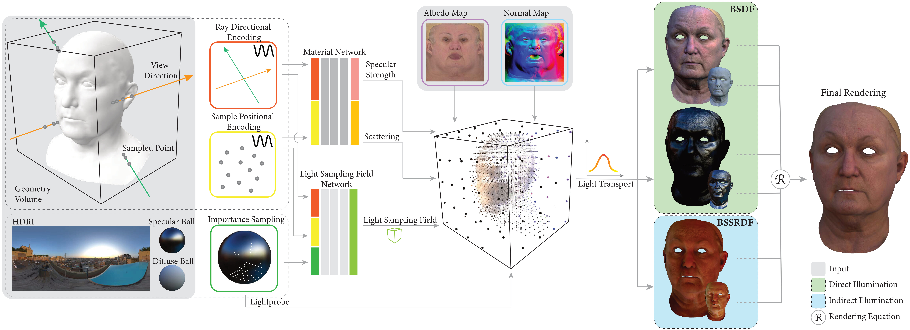
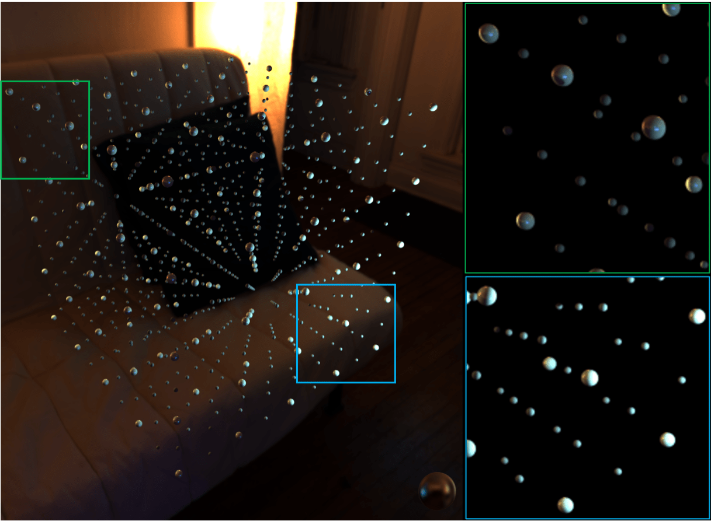
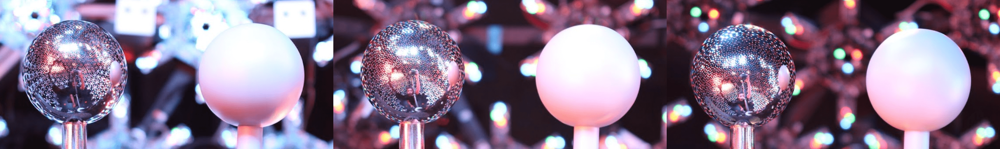
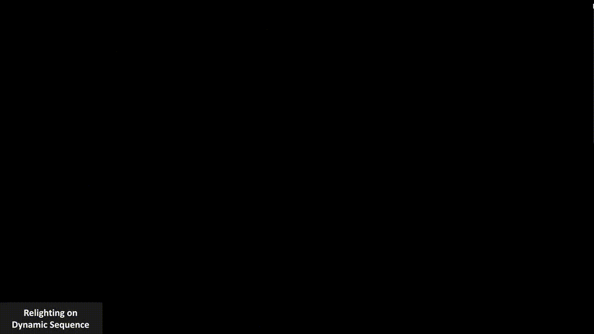
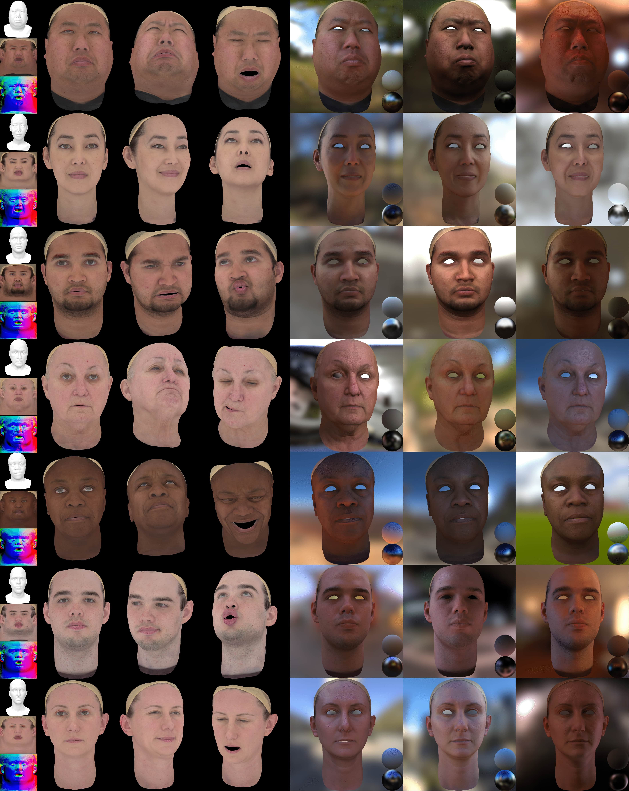

<!-- PROJECT LOGO -->
<p align="center">

  <h1 align="center">Light Sampling Field and BRDF Representation for Physically-based Neural Rendering</h1>
  <p align="center">
    <a href="https://jingyangcarl.com/"><strong>Jing Yang</strong></a>
    ·
    <a href="https://corneliushsiao.github.io/"><strong>Hanyuan Xiao</strong></a>
    ·
    <a href=""><strong>Wenbin Teng</strong></a>
    ·
    <a href=""><strong>Yunxuan Cai</strong></a>
    ·
    <a href="https://www.yajie-zhao.com/"><strong>Yajie Zhao</strong></a>
  </p>
  <h2 align="center">ICLR 2023</h2>
  <div align="center">
    
  </div>

  <p align="center">
  <br>
    <a href='https://arxiv.org/abs/2304.05472'>
      
    </a>
    <a href='https://openreview.net/forum?id=yYEb8v65X8'>
      
    </a>
    <a href='https://iclr.cc/media/PosterPDFs/ICLR%202023/11973.png'>
      
    </a>
    <a href='' style='padding-left: 0.5rem;'>
      
    <a href="https://youtu.be/qpIgS11DlJE"></a>
  </p>
</p>

<br />
<br />

<!-- TABLE OF CONTENTS -->
<details open="open" style='padding: 10px; border-radius:5px 30px 30px 5px; border-style: solid; border-width: 1px;'>
  <summary>Table of Contents</summary>
  <ol>
    <li>
      <a href="#Abstract">Abstract</a>
    </li>
    <!-- <li>
      <a href="#instructions">Instructions</a>
    </li> -->
    <!-- <li>
      <a href="#running-demo">Running Demo</a>
    </li> -->
    <li>
      <a href="#Overview">Overview</a>
    </li>
    <li>
      <a href="#More Qualitative Results">More Qualitative Results</a>
    </li>
    <li>
      <a href="#citation">Citation</a>
    </li>
  </ol>
</details>
<br />
<br />

## Abstract
Physically-based rendering (PBR) is key for immersive rendering effects used widely in the industry to showcase detailed realistic scenes from computer graphics assets. A well-known caveat is that producing the same is computationally heavy and relies on complex capture devices. Inspired by the success in quality and efficiency of recent volumetric neural rendering, we want to develop a physically-based neural shader to eliminate device dependency and significantly boost performance. However, no existing lighting and material models in the current neural rendering approaches can accurately represent the comprehensive lighting models and BRDFs properties required by the PBR process. Thus, this paper proposes a novel lighting representation that models direct and indirect light locally through a light sampling strategy in a learned light sampling field. We also propose BRDF models to separately represent surface/subsurface scattering details to enable complex objects such as translucent material (i.e., skin, jade). We then implement our proposed representations with an end-to-end physically-based neural face skin shader, which takes a standard face asset (i.e., geometry, albedo map, and normal map) and an HDRI for illumination as inputs and generates a photo-realistic rendering as output. Extensive experiments showcase the quality and efficiency of our PBR face skin shader, indicating the effectiveness of our proposed lighting and material representations.

## Light Sampling Fields
|         |
| :-------------------------------------------------------------: |
|                Light Sampling Field Visualization               |
|              |
|            Local Lighting Variations in Real Capture            |

## More Qualitative Results

|               |
| :-------------------------------------------------------------: |
|           Multiview Relighting on Dynamic Sequences             |
|           |
|             Relighting via HDRI as Global Lighting              |
|        |
|           Qualitative Results over Light Stage Scans            |

## Citation

```bibtex
@inproceedings{
    yang2023light,
    title       = {Light Sampling Field and {BRDF} Representation for Physically-based Neural Rendering},
    author      = {Jing Yang and Hanyuan Xiao and Wenbin Teng and Yunxuan Cai and Yajie Zhao},
    booktitle   = {The Eleventh International Conference on Learning Representations },
    year        = {2023},
    url         = {https://openreview.net/forum?id=yYEb8v65X8}
}
```

## Acknowledgments

We extend our gratitude to [Marcel Ramos](), [Pratusha Prasad](), [Bipin Koshore]() for their expert artistic contributions and technical assistance with hardware and capture tools. Additionally, our appreciation goes to the [ICON](https://github.com/YuliangXiu/ICON) for their impressive and visually stunning GitHub showcase page.

<br>

<!-- ## License

This code and model are available for non-commercial scientific research purposes as defined in the [LICENSE](LICENSE) file. By downloading and using the code and model you agree to the terms in the [LICENSE](LICENSE). -->